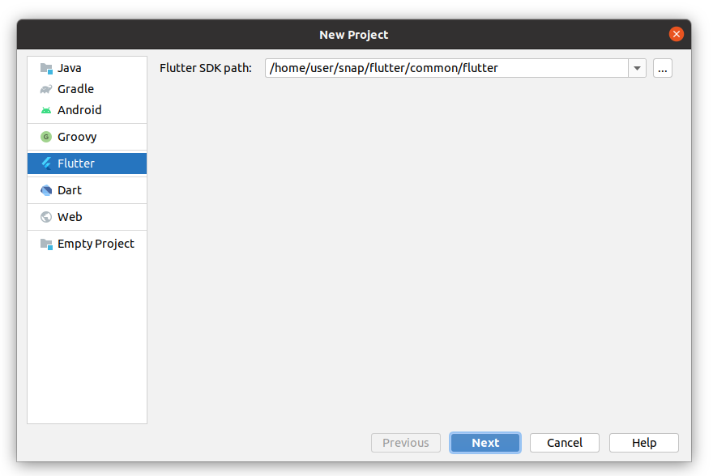
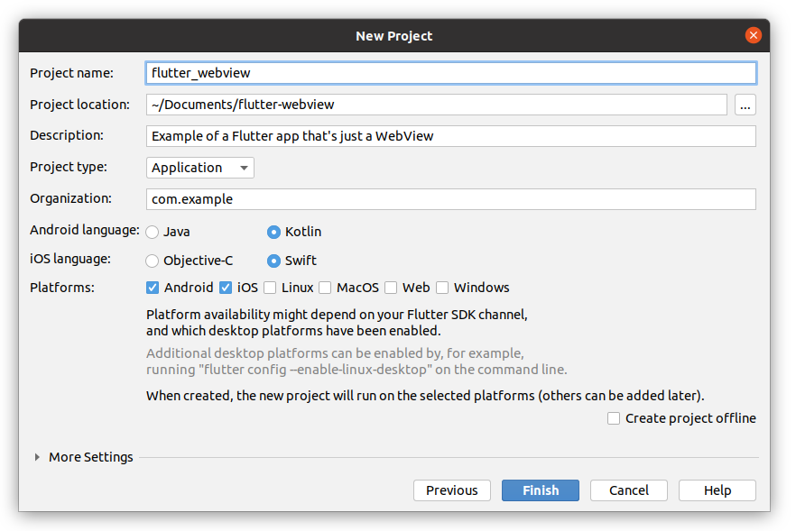

# Turning a website into a cross platform app with Flutter WebView

If you have a mobile website which you would like to turn into a cross platform app, you might want to start with a simple WebView that displays the site. You can then gradually expand the app with extra native functionality.

There are multiple cross-platform frameworks with which you can build a simple WebView app. This tutorial demostrates how to do this with Flutter.

The resulting code is [available on Github](https://github.com/Stijn-B/flutter-webview-example)

## Step 1: Create a Flutter project

You can create a Flutter project from the command line or from Android Studio

### Option A: Command line

```
flutter create flutter_webview
```

### Option B: Android Studio

1. In Android Studio go to `File` > `New` > `New Flutter Project...`

2. Follow the visual setup





### Android application ID

Your applicationId is your site domain in combination with an app name in reverse order. Here we use example.com with the flutter_webview name, resulting in com.example.flutter_webview.

After creating the project make sure you like the generated Android application ID set in `android/app/build.gradle`

```gradle
...

defaultConfig {
    applicationId "com.example.flutter_webview"
    ...
}
```

## Step 2: Install WebView

The Flutter ecosystem works with [Pub packages](https://pub.dev/flutter). We will add the [`flutter_webview` plugin](https://pub.dev/packages/webview_flutter) to the project and is it's WebView component to render a website.

**Installing `flutter_webview`**

Inside of the project folder, run the following command to add the plugin:

```shell
flutter pub add webview_flutter
```

**Updating `build.gradle`**

The plugin uses Platform Views to embed the Android’s webview within the Flutter app. It supports two modes: hybrid composition (the current default) and virtual display. [Read more about the differences between the two modes here](https://pub.dev/packages/webview_flutter#android-platform-views)

The *Hybrid composition* mode is the default and used in this example. It requires Android SDK 19 (while the *virtual display* mode requires Android SDK 20). 

Update `android/app/build.gradle` to specify the required and target SDK:

```gradle
defaultConfig {
    ...
    Version 19           // Set the required version (19 or 20)
    targetSdkVersion 33  // You can also set a target SDK version
}
```

## Step 3: Add WebView

Add the WebView to the app by replacing the content of `lib/main.dart` with:

```kotlin
import 'package:flutter/material.dart';
import 'package:webview_flutter/webview_flutter.dart';

void main() {
  runApp(
    const MaterialApp(
      home: WebViewApp(),
    ),
  );
}

class WebViewApp extends StatefulWidget {
  const WebViewApp({Key? key}) : super(key: key);

  @override
  State<WebViewApp> createState() => _WebViewAppState();
}

class _WebViewAppState extends State<WebViewApp> {
  @override
  Widget build(BuildContext context) {
    return Scaffold(
      body: const WebView(
        initialUrl: 'https://your_website.com',
      ),
    );
  }
}
```

The app is now a WebView of your website. JavaScript won't work yet because it is disabled by default.

## Step 4: Control navigation and enable JavaScript with `WebViewStack`

A WebViewStack enables control over aspects of the WebView. It can prevent navigations (based on checks you define yourself) and enable JavaScript (which is otherwise disabled by default).

Create a new file **`lib/src/web_view_stack.dart`** with the following content:

```kotlin
import 'package:flutter/material.dart';
import 'package:webview_flutter/webview_flutter.dart';

class WebViewStack extends StatefulWidget {
  const WebViewStack({Key? key}) : super(key: key);

  @override
  State<WebViewStack> createState() => _WebViewStackState();
}

class _WebViewStackState extends State<WebViewStack> {

  @override
  Widget build(BuildContext context) {
    return Stack(
      children: [
        WebView(
          initialUrl: 'https://your_website.com',
          // Control navigation
          navigationDelegate: (navigation) {
            final host = Uri.parse(navigation.url).host;
            if (host.contains('your_website.com')) {  // only navigate if the destination contains your domain
              return NavigationDecision.navigate;
            } else {
              return NavigationDecision.prevent;
            }
          },
          // Enable JavaScript
          javascriptMode: JavascriptMode.unrestricted,
        ),
      ],
    );
  }
}
```

Use this `WebViewStack` in your app by updating **`lib/main.dart`**:

```kotlin
import 'package:flutter/material.dart';
import 'src/web_view_stack.dart';  // <-- Replace the import of the webview_flutter package with an import of your WebViewStack

void main() {
  runApp(
    const MaterialApp(
      home: WebViewApp(),
    ),
  );
}

class WebViewApp extends StatefulWidget {
  const WebViewApp({Key? key}) : super(key: key);

  @override
  State<WebViewApp> createState() => _WebViewAppState();
}

class _WebViewAppState extends State<WebViewApp> {
  @override
  Widget build(BuildContext context) {
    return Scaffold(
      body: const WebViewStack(),  // <-- Replace the original WebView with you WebViewStack
    );
  }
}
```

## Extra

### Setting a custom icon

[`flutter_launcher_icons`](https://pub.dev/packages/flutter_launcher_icons) is a convenient package for setting a custom icon for your app. [The instructions provided by the package owner are short and clear](https://pub.dev/packages/flutter_launcher_icons#book-guide)
